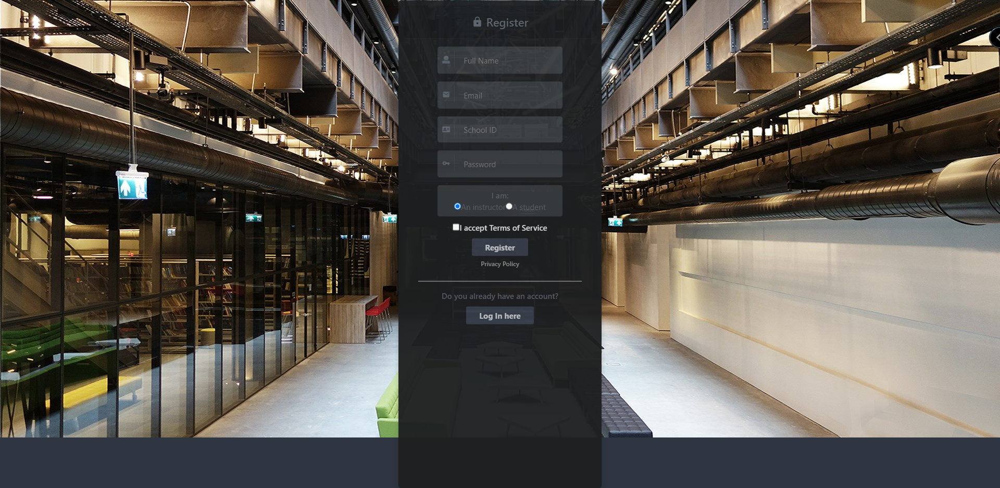
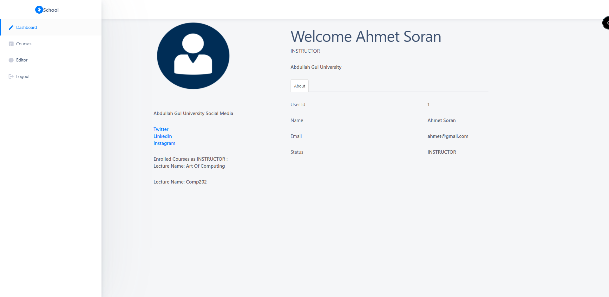
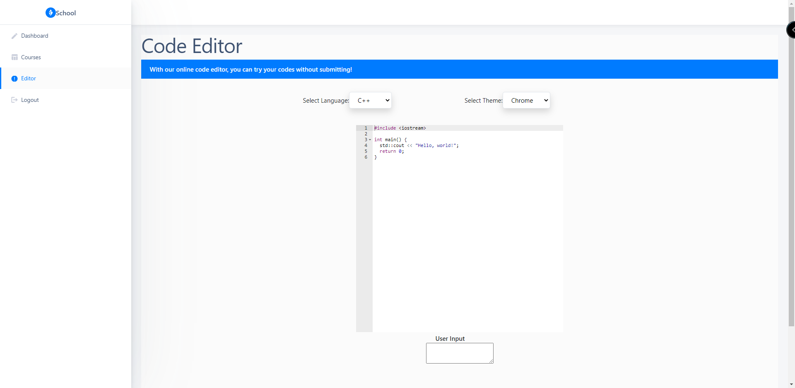
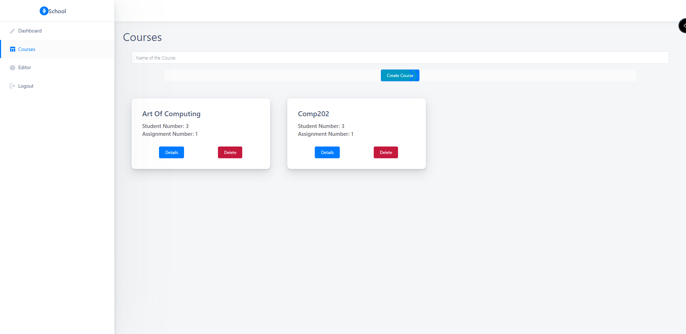
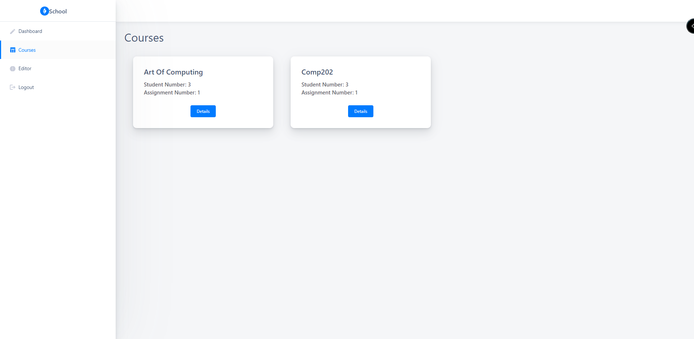
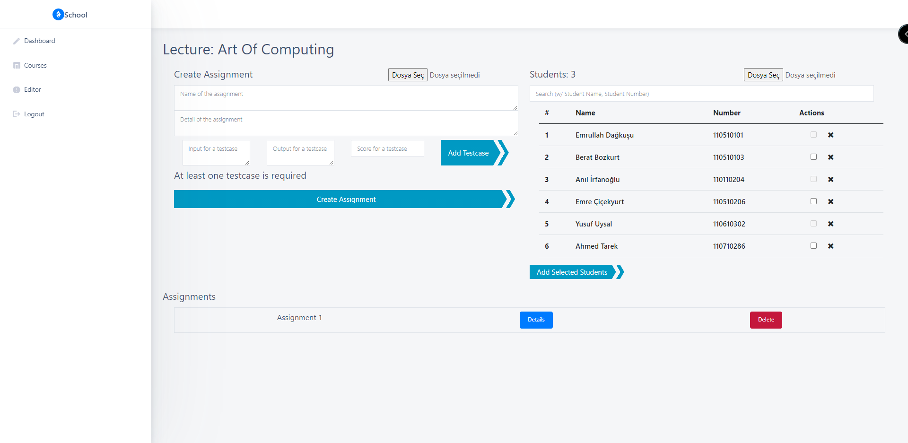
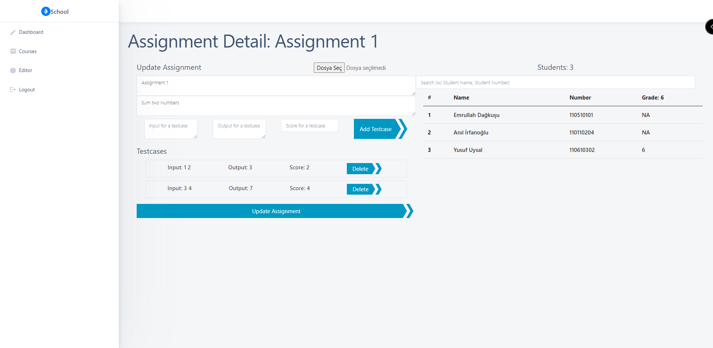
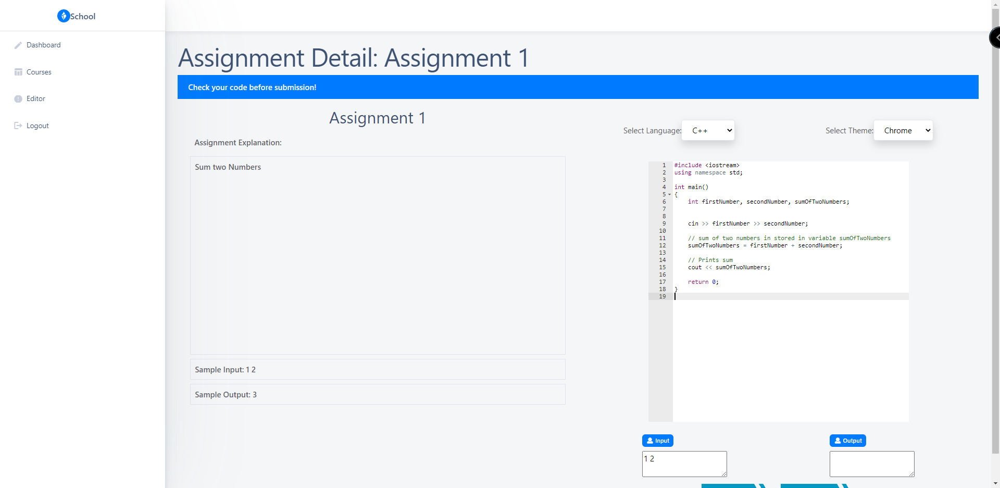
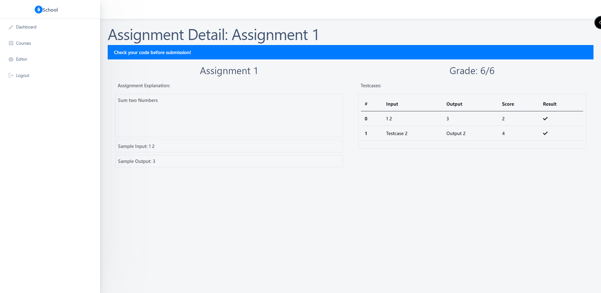

# Auto-Grading-System

## About Auto-Grading-System
In today's conditions, where software knowledge is important, the need for tools to measure a person's software knowledge is also of great importance. For this reason, the platform needed by the teachers to measure the software knowledge of the students has been solved with the software we have created.

## Installation Steps

1. Install `Docker`, `Docker Compose` and `npm`
1. `docker-compose build` to build the backend
1. `cd frontend && yarn install` to install dependencies for front-end
1. `docker-compose up --build` to start the docker container
1. Go to `http://localhost:8000/docs` to see the swagger UI
1. Go to `http://localhost:3000` to see the react front-end
1. `docker-compose down or ctrl + c` to down it

## Project Documnetation
In order to see the working principles of the project, the project must be run first. After the project is run, you can access the necessary documentation data by using the website links listed below.
Go to `http://localhost:8000/docs`
Go to `http://localhost:8000/redoc`

## Screenshots of Project
The images you see below are shared in order to get a general idea about the interface of the application.

### Login && Register Page

  
  

### Dashboard  &&  Code Editor Page

  
  

### Teacher Courses && Student Courses Page

  
  

### Instructor's Course &&  Assignment Details

  
  

### Student's Assignment &&  Submission Details Page

  
  

